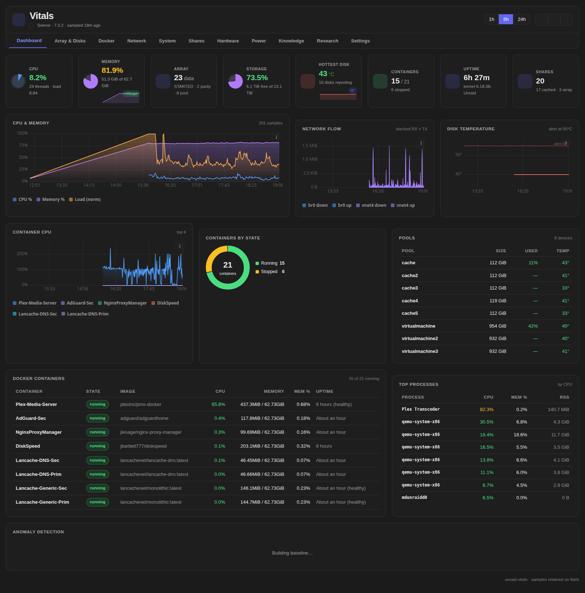

# unraid-vitals

A better Unraid dashboard. Deeper analytics, live charts and real history for CPU,
memory, network, temperatures, disks, Docker and SMART — all collected locally.
No InfluxDB, no Grafana, no telemetry.



## What you get

- **8 live stat cards** — CPU, memory, load, array fill, network, temps, Docker, GPU/UPS
- **Sparkline history** — 1 h / 6 h / 24 h windows for CPU, memory, network and temperatures
- **Full array table** — per-disk fill, temperature, error and SMART status at a glance
- **Docker breakdown** — per-container CPU and memory, sortable
- **SMART health** — reallocated / pending / CRC sectors and power-on hours per disk
- **GPU & UPS panels** — auto-detected when the hardware is present (NVIDIA via `nvidia-smi`)
- **Dashboard tile** — compact Vitals tile you can place anywhere on the stock dashboard
- **Start page switch** — optionally make Vitals the page you land on after login

Everything is collected **locally every minute** by a PHP collector that reads Unraid's
own state files (`/var/local/emhttp/*`, `/proc`, the Docker API, `nvidia-smi`, SMART
cache). History lives in a 24-hour RAM ring buffer plus tiny hourly rollups on the
flash drive — long-range trends without hammering the USB stick.

The stock dashboard is never modified: Vitals adds a page (`Tools → Vitals`), a tile
you can position, and an optional start-page switch.

## Requirements

- Unraid 6.12+ (developed and tested on 7.x)
- No dependencies. No external services. Works fully offline.

## Install

**Plugins → Install Plugin** (in the Unraid web UI), paste:

```
https://raw.githubusercontent.com/BeinnoLLC/unraid-vitals/main/plugins/unraid-vitals.plg
```

Unraid downloads the payload, verifies its MD5, runs the post-install (cron entry +
first sample) and the Vitals pages appear immediately — no reboot needed.

## Uninstall

Plugins → unraid-vitals → Remove. The cron entry and RAM buffer are cleaned up;
your flash-side history rollups are kept unless you delete
`/boot/config/plugins/unraid-vitals/` yourself.

## How it works

```
┌────────────┐   every minute    ┌───────────────┐   1/min   ┌──────────────────┐
│ cron       │ ────────────────▶ │ vitals-collect│ ────────▶ │ RAM ring buffer  │
│ (unraid)   │                   │ (collect.php) │           │ 24h @ 1 sample/m │
└────────────┘                   └───────────────┘           └────────┬─────────┘
                                                                      │ hourly
                     ┌────────────────────────────┐                   ▼
                     │ ajax.php ◀── vitals.js     │          ┌──────────────────┐
                     │ (polls while page open)    │          │ flash rollups    │
                     └────────────────────────────┘          │ (24 writes/day)  │
                                                             └──────────────────┘
```

| Path | Role |
|---|---|
| `Vitals.page` | Main dashboard page (Unraid `Tasks` menu) |
| `Vitals.Dashboard.page` | Compact tile for the stock dashboard |
| `VitalsSettings.page` | Sample interval, retention, start-page switch |
| `include/collect.php` | One sample of every metric source |
| `include/store.php` | Ring buffer + flash rollups |
| `include/ajax.php` | Polling endpoint for the UI |
| `scripts/vitals-collect.php` | Cron entry point |
| `scripts/install.sh` / `remove.sh` | Cron + config setup / teardown |

## Building from source

```
./build/build.sh 2026.09.28      # date-versioned, e.g. YYYY.MM.DD
```

Produces `dist/unraid-vitals.plg` (the install manifest) and
`dist/unraid-vitals-<version>-x86_64-1.txz` (the payload, attached to a GitHub
release). The `.plg` in `plugins/` is what users install; it points at
`releases/latest/download/`, so every release must ship the payload under the exact
versioned name.

## License

[MIT](LICENSE) — © 2026 BeinnoLLC
